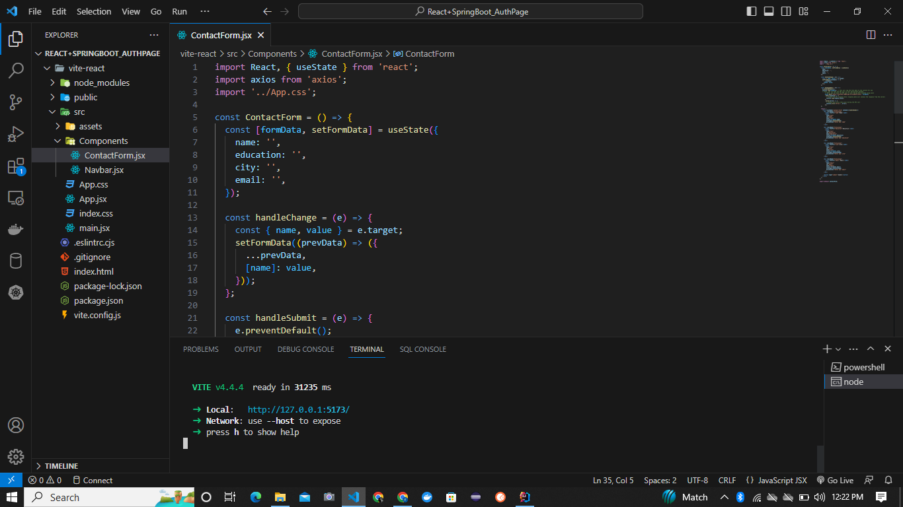
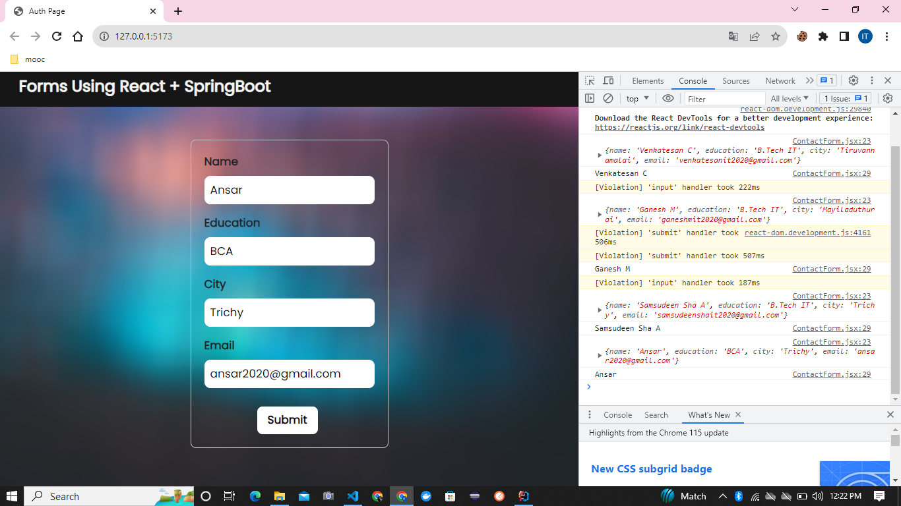
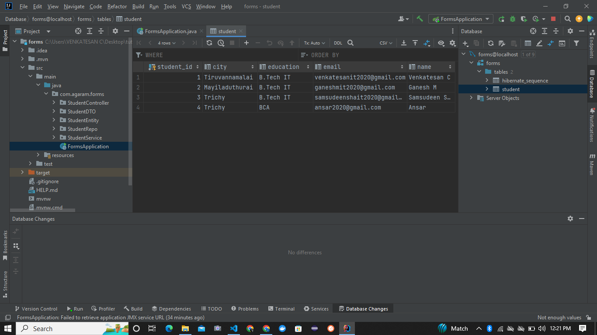
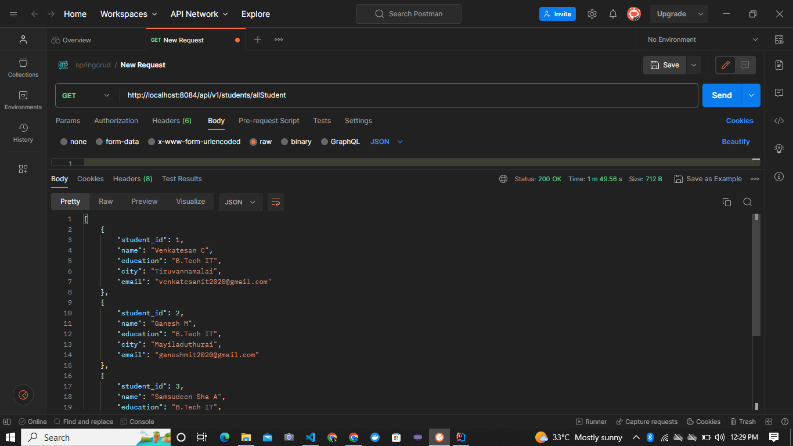

# Stack Application: React.js Frontend with Spring Boot Backend and MySQL Database
- ## React.js for the frontend
  

- ## Axios API
  

- ## Spring Boot for the backend
  

- ## MySQL for the database
  

- ## Additionally, you can test the backend API using Postman
  



## Description

This is a full-stack web application built using React.js for the frontend, Spring Boot for the backend, and MySQL for the database. The application allows users to submit data through a form on the React.js frontend, which is then sent to the Spring Boot backend via a RESTful API. The backend processes the data and stores it in a MySQL database. Additionally, you can test the backend API using Postman.

## Requirements

Before running the application, ensure you have the following installed:

- Node.js and npm for React.js frontend
- Java Development Kit (JDK) for Spring Boot backend
- MySQL Database
- Postman (for API testing)

## Getting Started

1. Clone the repository to your local machine.

```bash
git clone <repository_url>
